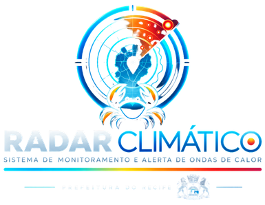

<div align="center">
  

  **Inteligência territorial e microclimática para detectar, comunicar e mitigar ondas de calor.**

  [](https://radarclimatico.vercel.app/)
  [](https://react.dev/)
  [](https://tanstack.com/start)
  [](https://tailwindcss.com/)
  [](https://www.typescriptlang.org/)
</div>

<br>

O **Radar Climático** é um projeto de inovação tecnológica focado na detecção, monitoramento e mitigação de ilhas de calor urbano no Recife. Desenvolvido sob o modelo B2G (*Business to Government*), o sistema capacita gestores públicos, defesas civis e órgãos municipais na tomada de decisões estratégicas baseadas em dados em tempo real.

🤝 **Parceria Institucional:** Desenvolvido por estudantes da **CESAR School** em parceria com a **Prefeitura do Recife** e o **COP-ARIES** (Centro de Operações do Recife / Agência Recife para Inovação e Estratégia).

---

## 👁️ Protótipo Funcional (MVP em Produção)

Você pode interagir e testar a interface operacional do nosso painel de controle diretamente pelo navegador:

👉 **[Acessar o MVP do Radar Climático](https://radarclimatico.vercel.app/)**

---

## 🎯 O Desafio Urbano

Recife é uma das capitais mais vulneráveis do Brasil a eventos climáticos extremos e picos de estresse térmico. A carência de sistemas integrados de monitoramento microclimático de alta granularidade prejudica a saúde pública — gerando desidratação, internações e sobrecarga nas Unidades de Pronto Atendimento (UPAs) —, além de dificultar o direcionamento assertivo de recursos para arborização urbana e infraestrutura verde resiliente.

**Persona Principal:** *Jorge Gonçalves (57 anos)* – Coordenador de Operações da Defesa Civil do Recife (CODECIR). Necessita cruzar anomalias de sensação térmica com vulnerabilidade socioespacial para despachar equipes de campo, emitir alertas antecipados e subsidiar ações preventivas conjuntas com a EMLURB, CTTU e Secretaria de Saúde.

---

## 🚀 Funcionalidades do Sistema

### 1. 🌡️ Mapa Térmico e Monitoramento em Tempo Real
* **Malha Urbana Vetorial:** Renderização dinâmica das principais artérias viárias, hidrografia do Rio Capibaribe e Beberibe, e pontos focais de monitoramento.
* **Seletores Integrados de Camadas:** Alternância instantânea no próprio mapa entre:
  * **Calor:** Anomalias térmicas de superfície e sensação térmica calibrada.
  * **Cobertura Vegetal:** Densidade de copa arbórea e índice NDVI orbital.
  * **Vulnerabilidade:** Índice de Vulnerabilidade Social (IVS) da população exposta.
* **Classificação Térmica de Bairros (Classes A a E):** Categorização de estresse bioclimático com recomendações operacionais dedicadas por órgão público (Defesa Civil, EMLURB, CTTU, Saúde).

### 2. 🌿 Cobertura Vegetal & Simulador de Arrefecimento
* **Mosaico Orbital Multiespectral (NDVI):** Visualização de manchas verdes e densidade de copa com resolução de 10m (padrão Sentinel-2).
* **Simulador Interativo de Arrefecimento:** Controle deslizante para projeção em tempo real de intervenções de plantio urbano ($0\%$ a $+40\%$ de árvores), calculando:
  * Queda projetada na temperatura de superfície (°C);
  * Alívio real na sensação térmica (°C);
  * Volume de mudas nativas necessárias para atingir a meta;
  * Área de sombreamento contínuo gerada ($m^2$);
  * Volume anual estimado de sequestro de $\text{CO}_2$ (ton/ano).
* **Tabela de Déficit Arbóreo por Bairro:** Ranking comparativo de todos os microterritórios em relação à meta da OMS ($30\%$ de copa contínua), com botão de carregamento direto no simulador.

### 3. 🏥 Vulnerabilidade Social & Impacto Sanitário
* **KPIs de Saúde e Demografia:** População de baixa renda em risco crítico, histórico de atendimentos nas UPAs por desidratação/insolação e faixas etárias sensíveis (crianças $<5$ anos e idosos $>65$ anos).
* **Curva Epidemiológica Cruzada:** Gráfico interativo com eixo duplo cruzando a temperatura máxima semanal com a taxa de admissões e atendimentos de emergência nas UPAs da Região Metropolitana.
* **Diagnóstico Diário de Risco:** Marcadores analíticos nos dias críticos ($>35 \text{ °C}$) indicando limiares de alerta para o sistema hospitalar.

### 4. 📊 Comparação Territorial & Séries Históricas
* **Análise Comparativa Bairro A × Bairro B:** Confronto de métricas entre territórios com perfis térmicos contrastantes (ex.: Santo Amaro vs. Casa Forte ou Dois Irmãos).
* **Dashboard Verde:** Priorização de áreas de intervenção e status de implantação de infraestrutura verde.
* **Gestão Operacional de Alertas:** Central de despacho rápido para Defesa Civil com registro de histórico e emissão de notificações de emergência.

---

## ⚙️ Arquitetura e Tecnologias

O projeto adota uma stack moderna, full-stack e de alta performance:

### Frontend & Core
* **Framework:** [React 19](https://react.dev/) (`react` 19.2)
* **Meta-Framework Fullstack / SSR:** [TanStack Start](https://tanstack.com/start) (`@tanstack/react-start` 1.168)
* **Mecanismo de Servidor / Deploy:** [Nitro Engine](https://nitro.build/) (com preset para Cloudflare Modules / Vercel Edge)
* **Roteamento:** [TanStack Router](https://tanstack.com/router) (Roteamento 100% tipado com geração estática de árvore)
* **Build Tool:** [Vite 8](https://vitejs.dev/) + `@vitejs/plugin-react`
* **Linguagem:** [TypeScript 5.8](https://www.typescriptlang.org/)

### Design System & Estilização
* **Estilização:** [Tailwind CSS v4](https://tailwindcss.com/) (`@tailwindcss/vite` 4.2)
* **Design Tokens:** Variáveis HSL/OKLab para gradientes térmicos (`--heat-1` a `--heat-5`), cobertura vegetal (`--canopy`) e vulnerabilidade social.
* **Componentes Base:** [Radix UI Primitives](https://www.radix-ui.com/) (Diálogos, Seletores, Dropdowns, Sliders, Accordions)
* **Ícones:** [Lucide React](https://lucide.dev/)
* **Notificações:** [Sonner](https://sonner.emilkowal.ski/)
* **Alternância de Tema:** Suporte nativo a *Dark Mode* e *Light Mode* persistente via contexto.

### Visualização de Dados & IoT
* **Mapas Vetoriais:** Renderização SVG vetorial responsiva para malha viária, polígonos de manchas de calor e satélite multiespectral.
* **Gráficos:** Curvas SVG analíticas e gráficos via [Recharts](https://recharts.org/).
* **Dataloggers IoT (Hardware em Campo):**
  * *Elitech RCW-800W TDE (WiFi):* Embarcados em frotas móveis de ônibus para varredura territorial dinâmica.
  * *Elitech RCW-800W THE (WiFi):* Instalados em abrigos, estações e zonas de controle para amostragem estática contínua.

---

## 📁 Estrutura do Projeto

```text
Arboris/
├── public/                 # Ativos estáticos e logotipos do Radar Climático
├── src/
│   ├── components/
│   │   ├── alerts/         # Modais de reporte e envio operacional de alertas
│   │   ├── auth/           # Modais de perfil e contato institucional
│   │   ├── dashboard/      # Telas de Cobertura Vegetal, Vulnerabilidade, Mapa de Satélite e Dashboard Verde
│   │   ├── history/        # Telas de Comparação Territorial A x B
│   │   ├── ui/             # Componentes reutilizáveis baseados em Radix UI
│   │   └── RecifeStreetMesh.tsx # Malha esquemática de vias e hidrografia do Recife
│   ├── context/            # Provedores de Autenticação e Tema (Dark/Light)
│   ├── lib/
│   │   ├── radar-data.ts   # Modelagem de dados, séries de sensores, IVS, NDVI e funções de simulação
│   │   └── utils.ts        # Utilitários de classes e cálculos
│   ├── routes/
│   │   ├── __root.tsx      # Layout mestre global
│   │   ├── index.tsx       # Dashboard principal (Tempo Real, Histórico, Verde, Alertas e Índice)
│   │   └── login.tsx       # Tela de autenticação institucional
│   ├── router.tsx          # Inicialização do TanStack Router
│   ├── server.ts           # Configuração do handler SSR TanStack Start
│   └── styles.css          # Design tokens, paletas térmicas e utilitários globais
├── package.json            # Dependências e scripts de execução
├── tsconfig.json           # Configurações do compilador TypeScript
└── vite.config.ts          # Configuração de build Vite com plugins TanStack e Tailwind
```

---

## 💻 Como Executar Localmente

### Pré-requisitos
* [Node.js](https://nodejs.org/) versão 18.18+ ou 20+
* Gerenciador de pacotes `npm` (ou `pnpm` / `yarn`)

### Passo a Passo

1. **Clone o repositório:**
   ```bash
   git clone https://github.com/leonidasprof/RadarClimatico.git
   cd RadarClimatico
   ```

2. **Instale as dependências:**
   ```bash
   npm install
   ```

3. **Inicie o servidor de desenvolvimento:**
   ```bash
   npm run dev
   ```
   O painel estará acessível em `http://localhost:8080/` (ou na porta informada no terminal).

4. **Para gerar o build de produção e testar:**
   ```bash
   npm run build
   npm run preview
   ```

---

## 🗺️ Roadmap de Evolução

* **Release 1 (Concluída / MVP):**
  * Dashboard operacional com monitoramento térmico em tempo real.
  * Módulo de Cobertura Vegetal com sensoriamento NDVI e Simulador de Arrefecimento.
  * Módulo de Vulnerabilidade Social integrado com dados epidemiológicos e demanda das UPAs.
  * Classificação de bairros (Classes A-E) e recomendações operacionais para órgãos municipais.
  * Disparo de alertas antecipados e cruzamento territorial entre bairros.

* **Release 2 (Próximas Fases):**
  * Integração com a API do aplicativo cidadão *Conecta Recife*.
  * Formulação de um *Life Quality Index* (LQI) microclimático por quarteirão.
  * Alertas preditivos via WhatsApp/SMS em parceria com a Defesa Civil.
  * Monitoramento da temperatura interna da frota de transporte coletivo.

---

## 👥 Equipe Arboris (CESAR School)

Projeto acadêmico multidisciplinar de Inovação Urbana e Governança Climática:

* **Odir Gonçalves de Albuquerque Filho** (Gestor de Projetos • GTI) – `ogaf@cesar.school`
* **Leonardo Maranhão Aureliano** (Tech Líder / Dev • GTI) – `lma@cesar.school`
* **Leônidas Leandro** (Designer / Dev • GTI) – `lls@cesar.school`
* **Thais Soares** (Designer / Dev • GTI) – `tsbs@cesar.school`
* **Patrick Cruz** (Dados • Banco de Dados) – `pjmc@cesar.school`
* **Ariely Dias** (Designer • GTI) – `adt@cesar.school`

<br>

<div align="center">
  
</div>